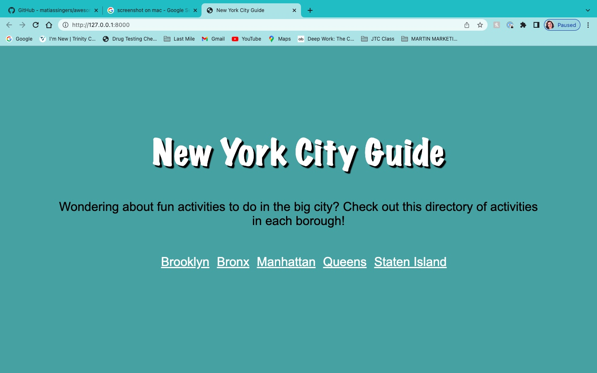
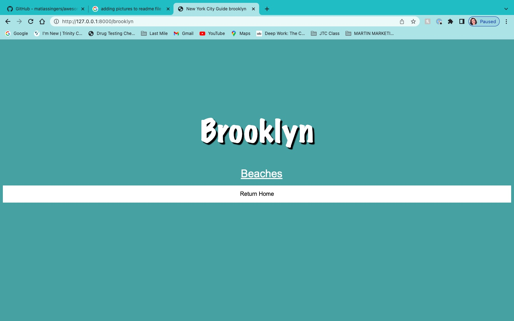
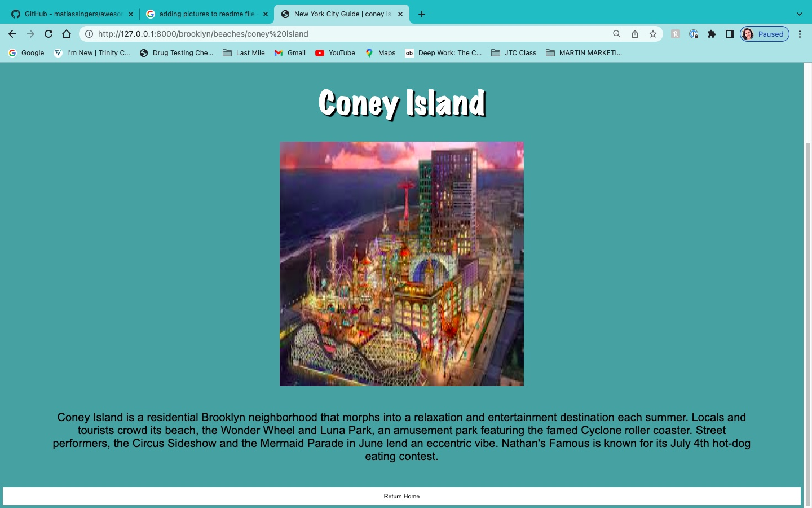

# This is our NYC GUIDE PROJECT #

Instructions:

### 1. Create a Virtual Environment
- To create virtual environment, first you create your virtual environment in the main folder. Run:<br>

```$ python3 -m venv venv```


from:https://py-vscode.readthedocs.io/en/latest/files/venv.html
### 2. Run the Virtual Environment
- Run the following command:
    - For Windows:<br>
        ```$ venv\Scripts\activate.bat```
    - For Mac:<br>
        ```$ . venv/bin/activate```
    - Your virtaul environment should be running in your terminal in 'venv' marker`

from:https://code.visualstudio.com/docs/python/tutorial-django
### 3. Install the Requirements
 - In order for the program to run we need to make sure we have the required libraries to run the program, programs change and update all the time, by running the following command you will install the proper ones to run this program. <br>
    ```$ pip install -r requirements```

### 4. How to run Django App
- Run your virtual environment <br>
        ```$ python3 manage.py runserver```

## How program looks
In order to run the program, please in your **internet server** type: http://localhost:8000. The opening page looks like the following page:



If you click on any of the links they will take you to activities offered at the borough, for example if you clicked Brooklyn and this is what shows up.


If you clicked the beaches, you come to a list of beaches offered in Brooklyn, similar to the home page. If you were to click Coney Island the following would be displayed:


If you have noticed on every page, there is a return home button. If you click that button, you will return home.

## Issues with Project
- Getting images for each activity being offered, we used the url from the website 
- Looping through each borough to get it to display correctly
- Remembering how to setup the virtual environment
- Styling was fun and yet difficult because we weren't sure how to set it up
# Group Members are : 
 Jonathan Wrenn: https://github.com/jonowrenn <br>
 Mikayla Munn: https://github.com/MikaylaMunn

